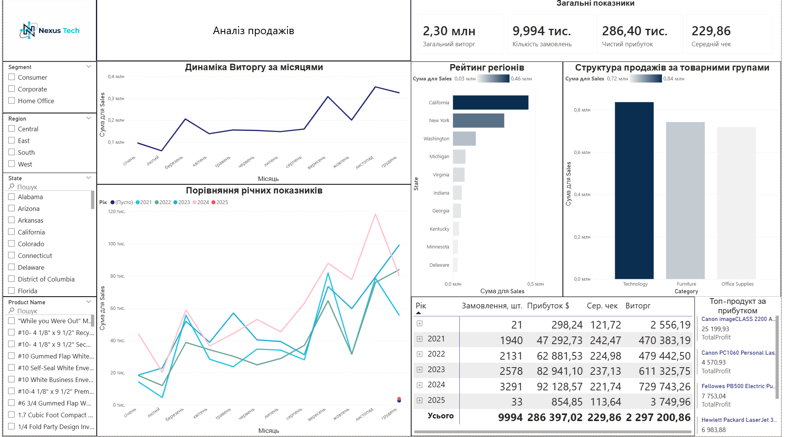

# Nexus-Tech-Sales-Analytics
Interactive Power BI Dashboard for Sales and Profitability Analysis

Sales & Profitability Analysis Dashboard — Nexus Tech

# 📊 Nexus-Tech-Sales-Analytics
*Interactive Power BI Dashboard for Sales and Profitability Analysis*

---

## 🚀 Огляд проекту
Цей дашборд створений для комплексного аналізу фінансових показників компанії **Nexus Tech**. Основна мета — надати бізнесу інструмент для моніторингу ключових метрик (KPI), аналізу динаміки продажів та виявлення найбільш прибуткових сегментів.

## 🛠 Технологічний стек
* **Інструмент візуалізації:** Power BI Desktop
* **Обробка даних:** Power Query (очищення, створення ієрархій)
* **Аналітика:** DAX (створення мір для обчислення прибутку та маржі)

## 📦 Основні блоки дашборду
* **📈 KPI-панель:** Загальний виторг ($2,30 млн), кількість замовлень, чистий прибуток та середній чек.
* **📅 Часовий аналіз:** Динаміка виторгу за місяцями та порівняння річних показників.
* **🌍 Структурний аналіз:** Рейтинг регіонів та аналіз товарних груп (Technology, Furniture, Office Supplies).
* **💎 Деталізація:** Картка топ-продукту за прибутком та розгорнута зведена таблиця.

## 💡 Ключові висновки (Insights)
1. **Найбільш прибуткова категорія:** Technology, попри те, що за обсягом замовлень вона може поступатися іншим.
2. **Сезонність:** Виявлено стійку тенденцію до зростання виторгу в останньому кварталі року.
3. **Ефективність:** Середній чек стабільний і становить приблизно **$229,86**.

## 📂 Як переглянути проект
1. Завантажте файл `Nexus_Tech_Sales_Analysis.pbix` з цього репозиторію.
2. Відкрийте його за допомогою [Power BI Desktop](https://powerbi.microsoft.com/desktop/).
3. Ви зможете переглянути модель даних, DAX-міри та взаємодіяти з усіма фільтрами.
## 🧠 Приклади використаних DAX-мір

```dax
// Чистий прибуток
TotalProfit = SUM('Orders'[Profit])

// Рівень маржинальності
Profit Margin = DIVIDE([Total Profit], [Total Sales], 0)

### 🧠 Приклади використаних DAX-мір

Для розрахунку ключових показників було створено наступні міри:

**1. Чистий прибуток (Total Profit):**
TotalProfit = SUM('Orders'[Profit])

**2. Рівень маржинальності (Profit Margin):**
Profit Margin = DIVIDE([Total Profit], [Total Sales], 0)

**3. Темп росту продажів (Sales Growth %):**
Sales Growth % = DIVIDE([Total Sales] - [Sales Last Month], [Sales Last Month], 0)
